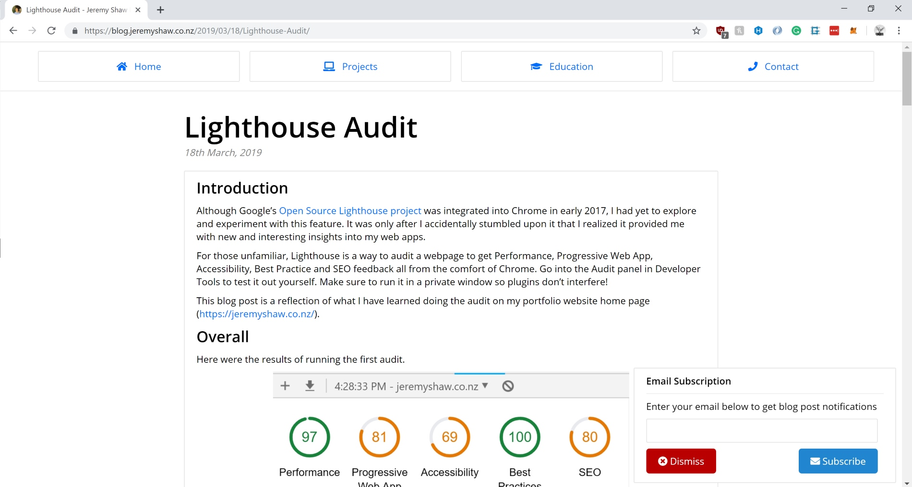

# Personal Blog

My personal Jeremy Shaw blog made using [Hexo](https://hexo.io/). Uses Firebase [Hosting](https://firebase.google.com/docs/hosting/) and [Functions](https://firebase.google.com/docs/functions/).

Uses an entirely custom Hexo theme which can be found in `themes/jeremy-blog-hexo`.


*Screenshot of an example blog post layout*

## Warning

There is currently an issue whereby `hexo generate` generates empty index.html files when using NodeJS v14 -> v16. Please use NodeJS 12 to build this project.

## Commands

View all Hexo commands at [https://hexo.io/docs/commands](https://hexo.io/docs/commands)

View all Firebase commands at [https://firebase.google.com/docs/cli/](https://firebase.google.com/docs/cli/)

_To setup the configuration, please rename `_config.yml.example` to `_config.yml`._

Start the server

``` bash
hexo server
```

Generate static files

``` bash
hexo generate
```

Create new article

``` bash
hexo new [layout] <title>
```

``` bash
hexo new post "Example Post"
```

Clean the cache and generated files

``` bash
hexo clean
```

Index the posts in Algolia for search functionality

``` bash
hexo algolia
```

Start the local Firebase server

``` bash
firebase serve
```

Deploy to Firebase

``` bash
firebase deploy
```

## License

MIT © [Jeremy Shaw](https://jeremyshaw.co.nz)